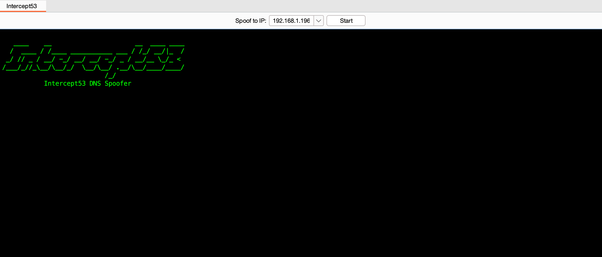

<pre>
   ____    __                      __  ____ ____
  /  ____ / /____ ___________ ___ / /_/ __/|_  /
 _/ // _ / __/ -_/ __/ __/ -_/ _ / __/__ \_/_ <
/___/_//_\__/\__/_/  \__/\__/ .__/\__/____/____/
                           /_/
           Intercept53 DNS Spoofer
</pre>
---
# 🥷 Intercept53 - DNS Spoofer for Burp Suite

Intercept53 is a lightweight Burp Suite extension that runs a local DNS server inside Burp to spoof all DNS responses to a user-specified IP. It's designed to help intercept apps (like Flutter Application) that ignore system proxy settings but still resolve domains via DNS.

## 👾 Features

- ✅ Spoofs all incoming DNS requests to a configurable IP
- 🧩 Integrated GUI tab in Burp Suite
- 🎯 Targets mobile apps that bypass proxy (e.g., Flutter)
- 🔧 Works with Burp Suite Community & Professional editions
- 🧪 Helpful for testing transparent proxy and MITM scenarios

---

## 📸 Burp Tab Screen

|  |
|:--:|
| *Intercept53 DNS Spoofer in Burp Suite* |

---

## 🧑‍💻 Installation 👩‍💻

### 📋 Requirements
- Burp Suite (Community or Pro)
- Jython standalone
- Run Burp as **root/administrator** to bind to port 53

### ⚙️ Setup
#### 📦 1. [Download Latest Release](https://github.com/propellerhead410/Intercept53/releases)

#### 🛡️ 2. Launch Burp Suite as **root/administrator**
- Required to bind to privileged port 53.
- On macOS/Linux: sudo ./burpsuite
- On Windows: Run as administrator

#### 🧩 3. Install the Extension
- Navigate to Extender → Extensions
- Load the .py file using Jython standalone

#### 🌐 4. Configure Burp Proxy
- Bind port 80 and 443 to all interfaces
- Enable ✅ Support invisible proxying for both ports

#### 📱 5. Point Mobile DNS to Burp Host
- Set your mobile device’s DNS to the IP address of your Burp Suite machine

#### 🔐 6. Trust the Burp CA Certificate
- Install Burp’s CA certificate on your mobile to allow HTTPS interception

#### ▶️ 7. Start Intercept53
- Go to the “Intercept53” tab in Burp Suite
- Click Start to begin spoofing DNS and intercepting traffic